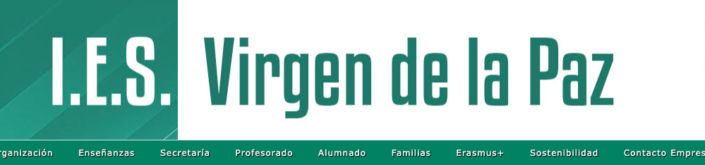

# Curso de Desarrollo de Aplicaciones Web a Distancia por IES Virgen de la Paz

💻 Repositorio del curso de Desarrollo de Aplicaciones Web a distancia.👨🏻‍🎓

Aquí iré subiendo toda la documentación relacionada con el curso además material adicional que puede servir de mucha ayuda.Gracias.

🚀 Happy Code!
> ##### Si consideras útil este curso, apóyalo haciendo "★ Star" en el repositorio. ¡Gracias!

## Index
- [Base de Datos](BASE_DE_DATOS)
- [Entornos de Desarrollo](ENTORNOS)
- [FOL ](FOL)
- [Inglés Técnico](INGLES)
- [Lenguaje de Marcas](LENGUAJE_MARCAS)
- [Leguaje de Programación](PROGRAMACION)
- [Sistemas Informáticos](SISTEMAS_INFORMATICOS)

🤩 Enjoy it!
## Enlaces de interés
* Web IES Virgen de la Paz: [IESVP](https://www.educa2.madrid.org/web/centro.ies.lapaz.alcobendas)
* Web: [Oracle](https://docs.oracle.com/en/java/javase/22/)
* Web: [Java](https://www.java.com/es/)
* Web oficial (Documentación, descarga...): [w3schools](https://www.w3schools.com/)
* Web Oficial de Mozilla: [Mozilla](https://developer.mozilla.org/es/)

### En mi perfil de GitHub tienes más información

#### Puedes apoyar mi trabajo haciendo "☆ Star" en el repo o nominarme a "GitHub Star". ¡Gracias!

